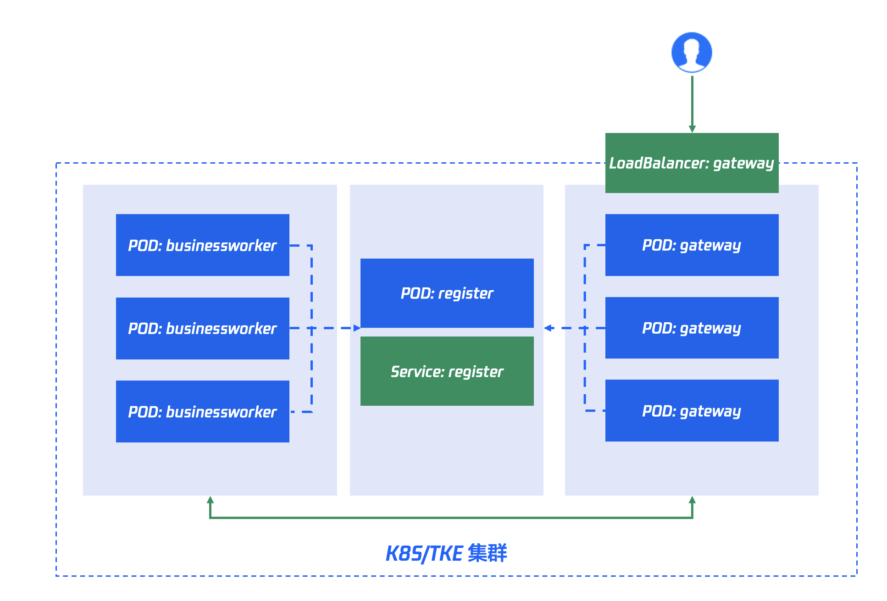

# 在 k8s 里部署 workman-chat

## 0 workman 介绍
Workerman是一个高性能的 socket 服务器通讯框架，用于快速开发各种网络应用，包括tcp的、udp的、长连接、短连接应用。


但他的官网并未提供 k8s 部署教程。下面咱们来用 K8S 部署一下 workerman-chat，他的源代码在 [https://github.com/walkor/workerman-chat](https://github.com/walkor/workerman-chat)。


本教程的包含了他的源代码，但修改了部分代码，修改处会在下文中说明，地址在 [https://github.com/cloudbeer/workerman-chat-k8s](https://github.com/cloudbeer/workerman-chat-k8s)


我们将按照如下的架构部署：



docker 镜像均已经上传到 hub.docker.com，可以在腾讯云 TKE 中直接运行。部署脚本如下：
```shell
kubectl apply -f ns.yaml
kubectl apply -f register.yaml
kubectl apply -f gateway.yaml
kubectl apply -f businessworker.yaml
```


## 1 编写 Dockerfile & 修改源代码
 workerman 运行环境，需要安装 pcntl，代码如下。
这个 docker 包标记为：cloudbeer/workerman-base:1.0
```dockerfile
FROM php:7.3

RUN docker-php-ext-configure pcntl --enable-pcntl \
    && docker-php-ext-install pcntl
```


我们使用分布式部署，所以需要修改 gateway 代码中的注册地址：127.0.0.1，但在容器中分布式部署，我们无法得知pod 的 ip，故改成动态获取 ip 的方式。
register 的 ip 也未知，但在 K8S 中，这个地址可以通过 service 发布出来，我们暂且命名这个服务为 register，gateway 和 businessworker 中注册中心的地址修改为 register 即可。


Applications/Chat/start_gateway.php，修改如下：
```php
//....
// 分布式部署时请设置成内网ip（非127.0.0.1）
// $gateway->lanIp = '127.0.0.1';
$gateway->lanIp = getHostByName(getHostName());

//....

// 服务注册地址
// $gateway->registerAddress = '127.0.0.1:1236';
$gateway->registerAddress = 'register:1236';

//....
```


Applications/Chat/start_businessworker.php，修改如下：
```php
//....

// 服务注册地址
// $worker->registerAddress = '127.0.0.1:1236';
$worker->registerAddress = 'register:1236';

//....
```


打包代码（别忘记 composer install 一下先）：
```dockerfile
FROM cloudbeer/workerman-base:1.0
RUN mkdir /app
COPY ./workerman-chat /app
```


## 2 部署 register


```yaml
apiVersion: apps/v1
kind: Deployment
metadata:
  name: workerman-chat-register
  namespace: workerman
  labels: 
    app: workerman-chat-register
spec:
  replicas: 1
  selector:
    matchLabels:
      app: workerman-chat-register
  template:
    metadata:
      labels:
        app: workerman-chat-register
    spec:
      containers:
      - name: register
        image: cloudbeer/workerman-code:1.0
        resources:
          requests:
            memory: "1Gi"
            cpu: "500m"
          limits:
            memory: "1Gi"
            cpu: "500m"
        ports:
        - containerPort: 1236
          protocol: TCP
        command: [php, /app/Applications/Chat/start_register.php, start]
---
apiVersion: v1
kind: Service
metadata:
    name: register
    namespace: workerman
spec:
    selector:
      app: workerman-chat-register
    ports:
    - protocol: TCP
      port: 1236
      targetPort: 1236
```


## 3 部署 gateway
部署 gateway 的 pod，由于需要对外提供服务，使用了 LoadBalancer 的 service 发布服务。这里也可以创建 ingress 来发布服务。
```yaml
apiVersion: apps/v1
kind: Deployment
metadata:
  name: workerman-chat-gateway
  namespace: workerman
  labels: 
    app: workerman-chat-gateway
spec:
  replicas: 1
  selector:
    matchLabels:
      app: workerman-chat-gateway
  template:
    metadata:
      labels:
        app: workerman-chat-gateway
    spec:
      containers:
      - name: gateway
        image: cloudbeer/workerman-code:1.0
        resources:
          requests:
            memory: "1Gi"
            cpu: "500m"
          limits:
            memory: "1Gi"
            cpu: "500m"
        ports:
        - containerPort: 7272
          protocol: TCP
        command: [php, /app/Applications/Chat/start_gateway.php, start]
---
apiVersion: v1
kind: Service
metadata:
    name: gateway
    namespace: workerman
spec:
    type: LoadBalancer
    selector:
        app: workerman-chat-gateway
    ports:
        - protocol: TCP
          port: 7272
          targetPort: 7272
```


## 4 部署 businessworker
businessworker 在内部工作，只需要部署 pod 即可。
```yaml
apiVersion: apps/v1
kind: Deployment
metadata:
  name: workerman-chat-businessworker
  namespace: workerman
  labels: 
    app: workerman-chat-businessworker
spec:
  replicas: 1
  selector:
    matchLabels:
      app: workerman-chat-businessworker
  template:
    metadata:
      labels:
        app: workerman-chat-businessworker
    spec:
      containers:
      - name: businessworker
        image: cloudbeer/workerman-code:1.0
        resources:
          requests:
            memory: "1Gi"
            cpu: "500m"
          limits:
            memory: "1Gi"
            cpu: "500m"
        command: [php, /app/Applications/Chat/start_businessworker.php, start]

```
## 测试服务
workerman-chat 提供了一个 聊天室的 web 测试端。


下面我们在本地启动这个聊天室：
先修改 websocket 的目标地址，为 gateway 的 Loadbalancer 的地址(假设为 1.2.3.4)，修改 Applications/Chat/Web/index.php 文件如下：
```php

       // ws = new WebSocket("ws://"+document.domain+":7272");
       ws = new WebSocket("ws://1.2.3.4:7272");
```


本地启动：
```shell
php ./Applications/Chat/start_web.php start
```
打开浏览器：[http://localhost:55151](http://localhost:55151/?)


多开几个聊天室，完美运行。


## 扩充实例
按照 workerman-chat 的文档，gateway 和 businessworker 可以扩展。register 为单实例，不能扩。

现在可以试着扩冲 businessworker 的数量：
```shell
kubectl scale --replicas=3 -f businessworker.yaml
```
或者直接修改 yaml 的 replicas 的数量。


扩展成功后，多开几个聊天室，就会发现 businessworker 的 pod 的日志开始接收聊天信息了。
测试的时候需要注意：只有新用户加入的时候，新扩展的 businessworker 才提供服务。


同理可扩充 gateway，gateway 的服务由 LoadBalancer 负载，经测试，聊天正常。


正式运行环境也可以使用 HPA 自动伸缩。

